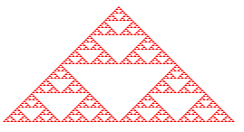
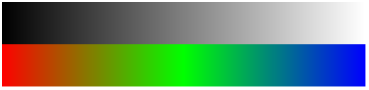
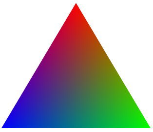
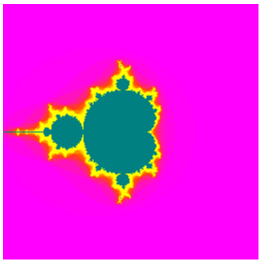

# WebGL Wrapper
WebGL Wrapper is a _JavaScript_ tool built on top of WebGL. It provides an interface which allows developers to easily access WebGL functionalities without interacting with complex WebGL interfaces.

## Sample
Following are some samples which are rendered using WebGL Wrapper. Their source code can be found in sample/

### Sierpinski Triangle

### Interpolation in Color Bars

### Maxwell Triangle

### Visualisation of Mandelbrot Set

## Discussion
- Email maintainer at [emad.bin.abid@gmail.com](emad.bin.abid@gmail.com)
- GitHub discussions